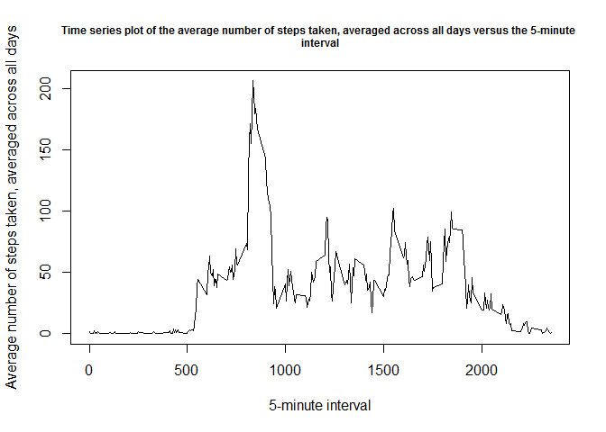
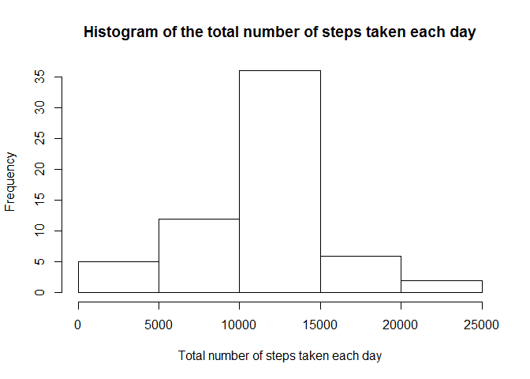

# Reproducible Research: Peer Assessment 1

## Loading and preprocessing the data

1. Load the data (i.e. read.csv())

```r
activity <- read.csv("activity.csv", header = TRUE)
```

2. Process/transform the data (if necessary) into a format suitable for your analysis

```r
aggregate1 <-aggregate(steps ~ date, data=activity, FUN=sum, na.rm=TRUE)
```

## What is mean total number of steps taken per day?

1. Make a histogram of the total number of steps taken each day

```r
hist(aggregate1$steps, main="Histogram of the total number of steps taken each day", xlab="Total number of steps taken each day")
```

 

2. Calculate and report the mean and median total number of steps taken per day

```r
mean(aggregate1$steps)
```

```
## [1] 10766.19
```

```r
median(aggregate1$steps)
```

```
## [1] 10765
```

## What is the average daily activity pattern?

1. Make a time series plot (i.e. type = "l") of the 5-minute interval (x-axis) and the average number of steps taken, averaged across all days (y-axis)

```r
aggregate2 <-aggregate(steps ~ interval, data=activity, FUN=mean, na.rm=TRUE)
plot(aggregate2$interval, aggregate2$steps, type = "l", main="Time series plot of the average number of steps taken, averaged across all days versus the 5-minute 
interval", cex.main=0.75, 
xlab="5-minute interval", ylab="Average number of steps taken, averaged across all days")
```

 

2. Which 5-minute interval, on average across all the days in the dataset, contains the maximum number of steps?

```r
orderedaggregate2 <- aggregate2[order(-aggregate2$steps), ]
head(orderedaggregate2)
```

```
##     interval    steps
## 104      835 206.1698
## 105      840 195.9245
## 107      850 183.3962
## 106      845 179.5660
## 103      830 177.3019
## 101      820 171.1509
```

```r
#The 104th 5-minute interval, corresponding to interval 835, on average across all the days in the dataset, contains the maximum
#number of steps.
```

## Imputing missing values

1. Calculate and report the total number of missing values in the dataset (i.e. the total number of rows with NAs)

```r
length(which(is.na(activity$steps)))
```

```
## [1] 2304
```

2. Devise a strategy for filling in all of the missing values in the dataset. The strategy does not need to be sophisticated. For example, you could use the 
mean/median for that day, or the mean for that 5-minute interval, etc.

```r
#If the number of steps is missing, fill in with the mean for that 5-minute interval.
```

3. Create a new dataset that is equal to the original dataset but with the missing data filled in.

```r
activity1 <- activity

missingsteps <- subset(activity1, is.na(activity1$steps) == "TRUE", "interval")
averagesteps <- unique(subset(aggregate2, interval %in% missingsteps$interval))

for(i in 1:nrow(activity1)) {
if (is.na(activity1$steps[i]) == "TRUE") {
  for(j in 1:nrow(averagesteps)) {
  if (averagesteps$interval[j] == activity1$interval[i]) {
		activity1$steps[i] <- averagesteps$steps[j] }}}
	else { activity1$steps[i] <- activity$steps[i] }
}
```

4. Make a histogram of the total number of steps taken each day and calculate and report the mean and median total number of steps taken per day. Do these values 
differ from the estimates from the first part of the assignment? What is the impact of imputing missing data on the estimates of the total daily number of steps?

```r
aggregate3 <-aggregate(steps ~ date, data=activity1, FUN=sum, na.rm=TRUE)
hist(aggregate3$steps, main="Histogram of the total number of steps taken each day", xlab="Total number of steps taken each day")
```

 

```r
mean(aggregate3$steps)
```

```
## [1] 10766.19
```

```r
median(aggregate3$steps)
```

```
## [1] 10766.19
```

```r
#The mean does not differ from the estimate from the first part of the assignment, but the median does.
#There is no impact of imputing missing data on the estimates of the total daily number of steps, as the mean is exactly the same.
```

## Are there differences in activity patterns between weekdays and weekends?

1. Create a new factor variable in the dataset with two levels - "weekday" and "weekend" indicating whether a given date is a weekday or weekend day.

```r
activity2 <- transform(activity1, weekday_or_weekend = ifelse(weekdays(as.Date(as.character(activity1$date), "%Y-%m-%d")) %in% c('Sunday','Saturday'), "weekend", 
"weekday"))
```

2. Make a panel plot containing a time series plot (i.e. type = "l") of the 5-minute interval (x-axis) and the average number of steps taken, averaged across all 
weekday days or weekend days (y-axis).

```r
aggregate4 <- aggregate(steps ~ interval + weekday_or_weekend, data=activity2, FUN=mean, na.rm=TRUE)
library(lattice)
xyplot(steps ~ interval | weekday_or_weekend, data=aggregate4, xlab="Interval", ylab="Number of steps", layout=c(1, 2), type="l")
```

 
